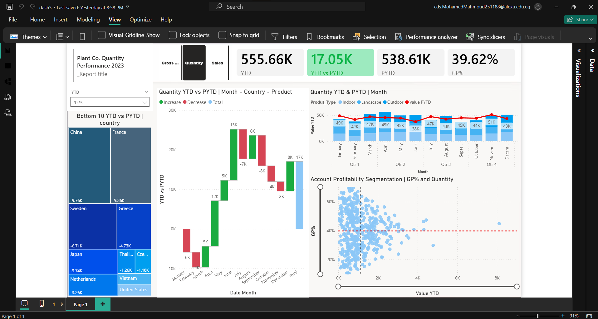

# Plant Co. Performance Dashboard (Power BI)

## Project Overview
An end-to-end Power BI dashboard developed to analyze the sales and profitability performance of **Plant Co.** This project focuses on comparing Year-to-Date (YTD) metrics against Prior-Year-to-Date (PYTD) to identify growth trends and performance gaps.

*Implementation based on the tutorial by [Mo Chen](https://youtu.be/BLxW9ZSuuVI).*

## Technical Features
- **Dynamic Measures:** Utilized `SWITCH` and `SELECTEDVALUE` DAX functions to allow users to toggle between **Sales**, **Quantity**, and **Gross Profit** across all visuals.
- **Time Intelligence:** Implemented YTD and PYTD calculations to provide period-over-period comparisons.
- **Advanced Visualizations:**
  - **Waterfall Chart:** To visualize the variance between YTD and PYTD by Month and Country.
  - **Scatter Plot:** For Account Profitability Segmentation (Gross Profit % vs. Value).
  - **Tree Map:** To identify the bottom 10 performing countries.
- **Dynamic Titling:** Custom DAX measures were created to update chart titles based on user slicer selections.

## Tech Stack
- **Power BI Desktop:** Report authoring and data visualization.
- **Power Query:** Data cleaning and modeling (Star Schema).
- **DAX (Data Analysis Expressions):** Complex calculations and dynamic measure switching.
- **Excel:** Primary data source.

## Dataset Structure
- **Fact Table:** Sales data (Invoices, Quantities, Costs).
- **Dimension Tables:** Date, Product Hierarchy, and Account details.

## How to View
1. Download the `.pbix` file from this repository.
2. Open it using **Power BI Desktop**.
3. Use the slicers at the top to interact with the data and switch between metrics.

